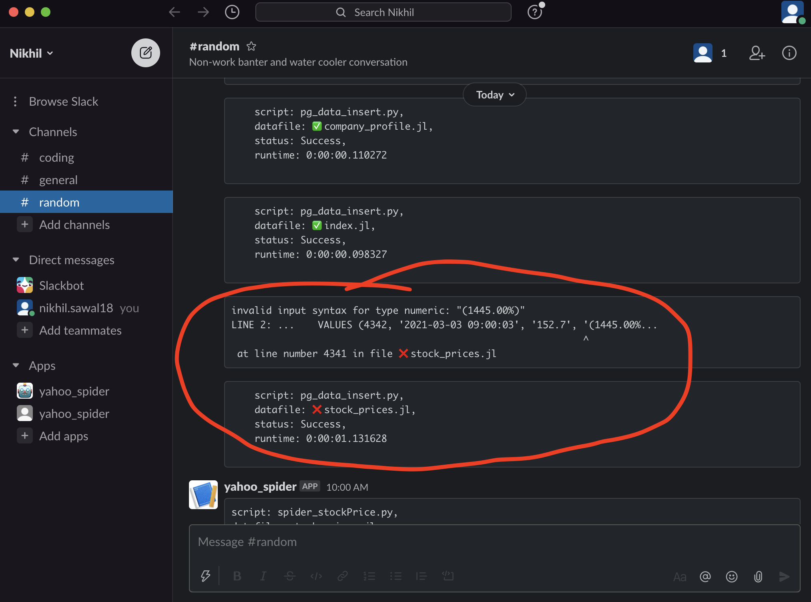

# **Investment Portfolio** [YouTube Link](https://www.youtube.com/watch?v=n83qkztDRfA)

## **Table of contents** <a name="top"></a>
1. [Overview](#overview)
2. [Problem Statement](#problem_statement)
3. [Motivation](#motivation)
4. [Current project stage](#current_project_stage)  
    4.1 [Extract/Web Scraping](#web_scraping)  
    4.2 [Transform](#transform)  
    4.3 [Load](#load)  
    4.4 [Virtual Environment](#virtual_env)  
    4.5 [Slack](#slack)  
5. [Exploratory Data Analysis (EDA)](#eda)  
    5.1 [Moving Averages](#moving_avg)  
    5.2 [MACD](#macd)  
    5.3 [Dash Application](#dash_app)  
    5.4 [Word Cloud](#word_cloud)  
6. [Machine Learning](#ml)
7. [To-Do](#todo)
8. [Resources](#resources)

## **1. Overview** <a name="overview"></a>

This is an end-to-end implementation that tries to cover several aspects of a machine learning project life-cycle. This project is my attempt to learn various technologies required for Data Science/Machine Learning and grow as a full stack Machine Learning Engineer. Through this project I have tried to cover 4 aspects of DS/ML project:

1. Data collection/extraction (web scraping)  **----> ```[COMPLETE]```** {More data might come in future}
2. Data storage                               **----> ```[COMPLETE]```**
3. Continuous integration                     **----> ```[IN-PROGRESS]```**
4. EDA, Visualization, model building & evaluation **----> ```[IN-PROGRESS]```**

## **2. Problem Statement** <a name="problem_statement"></a>

Coming up with innovative techniques to predict the market accurately, has become increasingly important given the uncertain times we live in. Through this project I want to emphasize on two broad categories of Machine Learning problems to test the following hypothesis:
- **Time series forecasting:** Can a rich storage of data help us predict important aspects of the stock market?
- **Natural language processing:** Can we use news data to model the impact of certain keywords on the trends of stocks belonging to different sector/industries?

## **3. Motivation** <a name="motivation"></a> - [Top](#top)

The idea for this project, struck me when we were hit by the pandemic in early 2020. I used to work for a gift cards selling company i.e [Raise Marketplace.](https://www.raise.com/) that acquired gift cards from over 3000 brands and sold them on its marketplace. The business was heavily impacted because of the pandemic, since a huge chunk of the companies revenue came from the travels & hotels industry.

- What if we had access to external data like news headlines? Could we have modeled the impact of the pandemic on several industries through their stock prices and made informed decisions about our acquisition strategies?

- Can we start storing information like news data and model the impact of a few key words to different industries, so that if a similar situation were to happen in the future, we can have a backup?

## **4. Current project stage** <a name="current_project_stage"></a> - [Top](#top)

- Three python scripts are currently operational that scrape different sets of data from **yahoo finance**.
- A  **cronjobs** is set to schedule these scrape & load the transformed data into Postgres.
- The data from the scrape is first stored to 3 **.jl via: stock_prices.jl, index.jl, company_profile.jl** files which are subsequently piped to a Postgres Database.
- A Slackbot then sends job notifications to my slack channel for handling errors.
- An interactive dashboard using Dash (python framework) runs locally. Shows moving averages computed over n-timestamps.
- Baseline univariate LSTM model that predicts stock prices for the next n-timestamps.

> Current technologies: Python, Scrapy, Slack (for notifications), Cronjob, PostgreSQL, GIT  
> Future technologies: Docker, Jenkins, Plotly/Flask, (Tensorflow/Keras/PyTorch)

*Figure 1* shows detailed representation of the project architecture.    

### **4.1 WEB SCRAPING** <a name="web_scraping"></a> - [Top](#top)
The orange boxes are Scrapy spiders written in Python that go on Yahoo Finance !! scrape three sets of information related to stock prices and store them in separate files (json lines). All scrapes are currently scheduled using ```cron``` and the frequency is every hour on business days from 8:00 am - 4:00 pm (CST). Following snippet shows the sample json lines format that is used by the scraper to store stock prices.

```
{"datetime": "2020-12-28 08:00:03", "name": "Uber Technologies, Inc. (UBER)", "price": "52.88", "delta_price": "-0.83", "delta_price_perc": "-1.55", "top_3_news": ["China Shows Jack Ma What an Activist Can Do", "Cathie Wood: Uber And Lyft Missed The Boat", "Zoom, Slack, and DocuSign: COVID-19 put these companies on the map in 2020"], "news_source": ["Bloomberg", "Benzinga", "Yahoo Finance"]}
{"datetime": "2020-12-28 08:00:03", "name": "Twilio Inc. (TWLO)", "price": "362.88", "delta_price": "-0.40", "delta_price_perc": "-0.11", "top_3_news": ["Is Twilio Stock A Buy Now After 435% Surge?", "Twilio Inc. (TWLO) Stock Sinks As Market Gains: What You Should Know", "Is Twilio Stock a Buy?"], "news_source": ["Investor's Business Daily", "Zacks", "Motley Fool"]}
{"datetime": "2020-12-28 08:00:03", "name": "Chegg, Inc. (CHGG)", "price": "92.41", "delta_price": "-0.67", "delta_price_perc": "-0.72", "top_3_news": ["These Are The 5 Best Stocks To Buy And Watch Now", "Generac, Intuitive Surgical, Chegg Lead 5 Stocks Holding At Buy Points", "Chegg (CHGG) Stock Sinks As Market Gains: What You Should Know"], "news_source": ["Motley Fool", "Investor's Business Daily", "Zacks"]}
{"datetime": "2020-12-28 08:00:03", "name": "Alphabet Inc. (GOOGL)", "price": "1734.16", "delta_price": "+5.93", "delta_price_perc": "+0.34", "top_3_news": ["Alphabet Is One of Barron\u2019s Top Stock Picks for the New Year. Here\u2019s Why.", "Yelp Adapted to the Pandemic. Now Its Stock Is Poised to Rebound.", "Quantum computers\u2019 power will remake competition in industries from technology to finance"], "news_source": ["Barrons.com", "Barrons.com", "MarketWatch"]}
{"datetime": "2020-12-28 08:00:03", "name": "Zynga Inc. (ZNGA)", "price": "9.91", "delta_price": "-0.02", "delta_price_perc": "-0.20", "top_3_news": ["Black Eyed Peas Encourage Fans to #PlayApartTogether for the Holidays In Social Campaign With Zynga", "Zynga (ZNGA) Stock Sinks As Market Gains: What You Should Know", "3 Videogame Stocks Set to Rise in 2021"], "news_source": ["Business Wire", "Zacks", "Barrons.com"]}
{"datetime": "2020-12-28 08:00:03", "name": "Etsy, Inc. (ETSY)", "price": "190.31", "delta_price": "+0.14", "delta_price_perc": "+0.07", "top_3_news": ["3 Growth Stocks That Doubled in 2020 and Could Do It Again in 2021", "Is There More Growth In Store For Etsy's (NASDAQ:ETSY) Returns On Capital?", "3 Surefire Stocks to Buy With Your $600 Stimulus Check"], "news_source": ["Simply Wall St.", "Simply Wall St.", "Motley Fool"]}
{"datetime": "2020-12-28 08:00:04", "name": "United Airlines Holdings, Inc. (UAL)", "price": "43.26", "delta_price": "-0.85", "delta_price_perc": "-1.93", "top_3_news": ["10 Best Airline Stocks To Buy For 2021", "United Airlines (UAL) Stock Sinks As Market Gains: What You Should Know", "United passengers traveling to Newark from U.K. required to show negative COVID test"], "news_source": ["Motley Fool", "Zacks", "MarketWatch"]}
{"datetime": "2020-12-28 08:00:04", "name": "GoHealth, Inc. (GOCO)", "price": "14.10", "delta_price": "+0.18", "delta_price_perc": "+1.29", "top_3_news": ["Is GOCO A Good Stock To Buy Now?", "GoHealth Appoints Dr. Paul Hain, M.D. as Chief Medical Officer", "GoHealth to Present at the Evercore Virtual Healthcare Conference on December 2, 2020"], "news_source": ["Insider Monkey", "PR Newswire", "PR Newswire"]}
{"datetime": "2020-12-28 08:00:04", "name": "Shopify Inc. (SHOP)", "price": "1225.52", "delta_price": "+27.56", "delta_price_perc": "+2.30", "top_3_news": ["Is Shopify Stock a Buy After Its Online Holiday Shopping Bonanza?", "Shopify vs Wayfair: Which E-Commerce Stock Could Continue to Rise in 2021?", "These 3 Stocks Are the Real Deal"], "news_source": ["Motley Fool", "TipRanks", "Motley Fool"]}
{"datetime": "2020-12-28 08:00:04", "name": "Tesla, Inc. (TSLA)", "price": "661.77", "delta_price": "+15.79", "delta_price_perc": "+2.44", "top_3_news": ["5 Things You Didn't Know About QuantumScape", "The Stock Market Could Gain Another 10% Next Year, Experts Say", "QuantumScape Was Unknown. Now It\u2019s One of the Most Valuable Stocks in the Car Industry."], "news_source": ["Motley Fool", "Barrons.com", "Barrons.com"]}
{"datetime": "2020-12-28 08:00:04", "name": "Chipotle Mexican Grill, Inc. (CMG)", "price": "1412.55", "delta_price": "+1.56", "delta_price_perc": "+0.11", "top_3_news": ["Data: Foot traffic at Domino\u2019s, Burger King, Pizza Hut tumble by more than half during COVID-19", "These Are The 5 Best Stocks To Buy And Watch Now", "Chipotle Mexican Grill (CMG) Stock Sinks As Market Gains: What You Should Know"], "news_source": ["Yahoo Finance", "Investor's Business Daily", "Zacks"]}

```

### **4.2 Transform** <a name="transform"></a> - [Top](#top)
The raw format of data presented in the above section is then cleaned using regex expressions before it makes it way to the database. ```Figure 1``` highlights the architecture of the project. The 3 green boxes are 3 separate files that store the scraped data in json lines format.

|  |
|:--:|
| *Figure 1: Project Architecture* |

### **4.3 Load** <a name="load"></a> - [Top](#top)
A postgres database is created using the python package ```psycopg2``` that provides a pythonic interface to perform SQL like operations eg: ```CREATING database/tables, ALTERING information, INSERT/UPSERT operations```. The credentials needed to establish connections are stored as environment variables in ```~/.bash_profile``` script. All information related to data collected is shown in ```Figure 2```

|  |
|:--:|
| *Figure 2: Database tables & Columns* |

```Figure 3``` shows sample data query in PostgreSQL

|  |
|:--:|
| *Figure 3: Stock price data in PostgreSQL* |

### **4.4 Virtual Environment** <a name="virtual_env"></a> - [Top](#top)
All the operations until the load stage are neatly packaged into a virtual environment that uses ```Python --version 3.8.7```. The green dashed line in ```Figure 1``` represents the virtual environment. A ```requirements.txt``` is also generated that store the versions of dependancies used for the application.

### **4.5 Slack** <a name="slack"></a> - [Top](#top)
A ```helper_functions.py``` script sends job completion notifications to a slack channel of the following format. *More improvements to come in future.* ```Figure 4```shows sample slack notifications.

```Figure 4.``` shows the sample error message when the spider scrapes data formats that is not compatible for loading into the database. **The error also highlights the filename and line number of the respective datafile on which the error occurred for easy tracking.**

|  |
|:--:|
| *Figure 4: Slack Error Notification* |

## **5. Exploratory Data Analysis (EDA)** - <a name="eda"></a> [Top](#top)

Moving averages are a commonly used techniques to smooth a noisy time-series data. With the investment use case, it can be used both as a signaling technique and for forecasting. In this section I will be focusing more on the how we can use moving averages to signal buy/sell decisions for a stock. The 3 techniques we will be discussing are:  
1. Simple Moving Average
2. Exponential Moving Average
3. Weighted Moving Average
4. Moving Average Convergence Divergence (MACD)

### 5.1 Moving Averages - <a name="moving_avg"></a> [Top](#top)

Figure. 5 compares how each of the above techniques respond to price change in Uber stock price. Each of the moving averages is calculated using a 9 and 12 period timeframe, which means that each instance of the moving averages is computed as a function of the previous 9 or 12 stock prices. The reason why we use two different timeframes (9 and 12) to compute moving averages is because the cross-overs between the two is considered as a signal to buy/sell stocks.

Right of the bat we can see that the simple moving average is a more smooth curve as compared to the other two but is less responsive to price changes. This behavior stems from the fact that the simple moving average treats all previous stock prices equally where as the other two compensate by putting weights on them.

We use the following two rules to make these decisions:
- **Sell the stocks when the short-term ma (here after ma is used for moving average) or 9-period ma crosses over the long-term ma or 12-period ma in a downward direction.** The reason why we do this is because 9-period ma crossing over 12-period ma signifies that the drop in the prices in the most recent times (9 days) is significantly higher than that in the past 12 days.

- **Buy when the short-term ma or 9-period ma crosses over the long-term ma or 12-period ma in a upward direction.** The reason why we do this is because 9-period ma crossing over 12-period ma in upward direction, signifies that the lift in the prices in the most recent times (9 days) is significantly higher than that in the past 12 days.

The relative positions of the red dashed line in Fig. 5 shows how the weighted and exponential ma techniques are more quicker in identifying signals as compared to the simple moving average.

|  |
|:--:|
| *Figure 5: Moving Averages* |

### 5.2 MACD - <a name="macd"></a> [Top](#top)

MACD or Moving average convergence divergence is another indicator commonly used in investment world to signal buy/sell decisions. It consists of two lines, the MACD line and Signal line
> MACD = 12 period EMA - 26 period EMA (These EMA's are calculated over stock prices)  
> Signal = 9 period EMA of MACD line  

Sell when the MACD line crosses Signal line in downward direction and Buy when MACD line crosses Signal line in upward direction.

|  |
|:--:|
| *Figure 6: MACD* |

### 5.3 Dash Application - <a name="dash_app"></a> [Top](#top)

Following figure show first look of the investment app. The app for now provides the ability to compute simple/exponential/weighted moving averages computed over different timestamps. Currently the application is being developed and run locally but soon will be hosted on Heroku and available for public use.

|  |
|:--:|
| *Figure 7: Investment App (First Look)* |

### 5.4 Word Cloud - News Data - <a name="word_cloud"></a> [Top](#top)

Movements of the stock prices are often impacted by News headlines (or Word of mouth). When the news of the pandemic started hitting different media channels, how long did it take before the stock market felt its impact? What was the impact on different industries? Can we generate a rich repository of news headlines and model its impact on the stock market in terms of risk and hedging strategies? Can we identify a few key words that trigger these movements?

Through this exploratory data analytics, I want to visualize keywords associated with ```-ve & +ve``` delta stock price.

Figure 8. shows keywords associated with -ve delta.

|  |
|:--:|
| *Figure 8: News <-> (-ve) Delta Stock Price Mapping* |

Figure 9. shows keywords associated with +ve delta.

|  |
|:--:|
| *Figure 9: News <-> (+ve) Delta Stock Price Mapping* |

## **6. Machine Learning** <a name="ml"></a> - <a name="eda"></a> [Top](#top)
### 6.1 Forecasting
#### 6.1.1 Long Short Term Memory (LSTM)

|  |
|:--:|
| *Figure 10: Twilio stock price predictions (1 timestamp)* |

|  |
|:--:|
| *Figure 11: Google stock price predictions (10 timestamp)* |

## **7. To-Do** <a name="todo"></a> - [Top](#top)

### Web Scraping
1. Increase frequency of scrapes from current per-hour.
2. Write script for rotating proxies, to avoid getting IP blocked.
3. Write script to scrape min, max stock price, volume.
4. Add random pause to the script.
5. Write a prediction model to predict missing values.

### Data Storage
1. Read on normalizing database
2. Create ID's for company names and reference them as foreign keys in different tables.
3. Read how to create relationships between tables in db/

### Exploratory Data Analysis
1. Write a script to determine best Moving average period. ----> [Later will be used as input to make predictions]
2. Use news data to identify set of keywords associated with stock price drops i.e negative delta and positive delta. Later use these term-frequencies to generate word cloud or network graph for visualizations

### Machine Learning
1. Forecasting Models:    
    - LSTM (Univariate and Multivariate)
    - ARIMA
    - Fast Forier Transform
    - Model performance monitoring and optimization


2. Clustering:  
Identify relationship between different sector/industry of the company. Strategy for hedging!!
    - Self Organizing Maps (SOM)

### Web App
1. Deploy a flask app on Heroku
2. Plan for the structure of the app


## **8. Resources** <a name="resources"></a> - [Top](#top)
- Web Scraping: [https://docs.scrapy.org/en/latest/intro/overview.html](https://docs.scrapy.org/en/latest/intro/overview.html)  
- Virtual Environment: [Corey Schafer: https://www.youtube.com/watch?v=Kg1Yvry_Ydk](https://www.youtube.com/watch?v=Kg1Yvry_Ydk)  
- Cronjob: [Corey Schafer: https://www.youtube.com/watch?v=QZJ1drMQz1A&t=418s](https://www.youtube.com/watch?v=QZJ1drMQz1A&t=418s) ,  
[Indian Pythonista: https://www.youtube.com/watch?v=Q2CNZGEH59Q&t=870s](https://www.youtube.com/watch?v=Q2CNZGEH59Q&t=870s)  
- Environment variables: [Corey Schafer: https://www.youtube.com/watch?v=5iWhQWVXosU&t=164s](https://www.youtube.com/watch?v=5iWhQWVXosU&t=164s)
- Slack bot: [Tech and Beyond with Moss: https://www.youtube.com/watch?v=lEQ68HhpO4g](https://www.youtube.com/watch?v=lEQ68HhpO4g) ,  
[Abhishek Thakur: https://www.youtube.com/watch?v=jDqjSd42024&t=379s](https://www.youtube.com/watch?v=jDqjSd42024&t=379s)
- Postgres: [Dataquest: https://www.dataquest.io/blog/loading-data-into-postgres/](https://www.dataquest.io/blog/loading-data-into-postgres/) ,  
[PostgreSQL Tutorial: https://www.postgresqltutorial.com/postgresql-python/connect/](https://www.postgresqltutorial.com/postgresql-python/connect/)
- Docker: [TechWorld with Nana: https://www.youtube.com/watch?v=3c-iBn73dDE&t=8377s](https://www.youtube.com/watch?v=3c-iBn73dDE&t=8377s)
